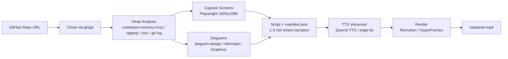

# RepoStudio

[](https://github.com/wushidiguo/RepoStudio/actions/workflows/ci.yml)
[](LICENSE)

Turn any GitHub repository into a **1–3 minute narrated explainer video**.

RepoStudio ships as a [Codex](https://openai.com/codex/) skill that autonomously
clones a repository, digs into its code, captures key screens, draws diagrams,
writes a timed narration script, synthesizes a voiceover, and renders a final
MP4 — no manual editing required.

> 🌏 中文版说明见 [README.zh-CN.md](README.zh-CN.md)

> 🎬 [PRcast](https://github.com/wushidiguo/PRcast) — turn a single pull request into a narrated explainer video, built on RepoStudio.

## What it does



Watch a real example produced by the pipeline — a 78-second explainer of
[Typer](https://github.com/fastapi/typer), including generated screenshots,
an architecture diagram, and an edge-tts voiceover:

[sample-output.mp4](sample-output.mp4)

## Highlights

- **Deep analysis, not just the README.** Uses
  [codebase-memory-mcp](https://github.com/DeusData/codebase-memory-mcp) to
  index the codebase into a knowledge graph (architecture, call chains,
  semantic search, routes, impact analysis) and falls back to
  ripgrep + cloc + git log when the MCP is unavailable.
- **Single source of truth.** One `manifest.json` drives the script, the TTS
  voiceover, and the renderer — every scene maps to a visual, and audio is
  aligned to scenes automatically.
- **Two render engines.** Bundled [Remotion](https://remotion.dev) template by
  default (deterministic, works anywhere Node runs); optional
  [HyperFrames](https://github.com/heygen-com/hyperframes) when the environment
  provides it.
- **Tiered TTS.** [Qwen3-TTS-12Hz-1.7B-CustomVoice](https://huggingface.co/Qwen/Qwen3-TTS-12Hz-1.7B-CustomVoice)
  (9 preset speakers + emotion instructions, needs a GPU) or
  [edge-tts](https://github.com/rany2/edge-tts) (fast CPU fallback).
- **Editorial diagrams.** Integrates the
  [diagram-design](https://github.com/cathrynlavery/diagram-design) skill
  (27 self-contained HTML+SVG diagram types), with Mermaid/Graphviz fallbacks.
- **Cinematic output.** Ken Burns motion on screenshots, count-up numbers,
  word-by-word burn-in captions, EBU R128 loudness normalization, and `.srt`
  subtitle export.
- **Quality gates.** The final video must be 60–180 s, include a voiceover, use
  at least one screenshot and one diagram, and pass an `ffprobe` check before
  delivery.

## Requirements

| Tool | Purpose | Install |
| --- | --- | --- |
| git | cloning | `winget install Git.Git` / `brew install git` |
| Node.js ≥ 18 | Remotion rendering | `winget install OpenJS.NodeJS.LTS` / `brew install node` |
| Python ≥ 3.9 | TTS, capture, duration scripts | `winget install Python.Python.3.12` / `brew install python` |
| FFmpeg | audio concat + verification | `winget install Gyan.FFmpeg` / `brew install ffmpeg` |
| gh (optional) | authenticated clone + repo metadata | `winget install GitHub.cli` / `brew install gh` |
| codebase-memory-mcp (optional) | deep analysis | official [install script](https://github.com/DeusData/codebase-memory-mcp) |
| Qwen3-TTS (optional, GPU) | best-quality voiceover | `pip install qwen-tts torch torchaudio soundfile` |
| diagram-design (optional) | editorial diagrams | `codex plugin marketplace add cathrynlavery/diagram-design` |

## Quick start

### 1. Install the skill

Windows (PowerShell):

```powershell
.\install.ps1            # installs the skill + checks prerequisites
.\install.ps1 -Full      # also installs core tools, edge-tts, Remotion deps, codebase-memory-mcp
```

macOS / Linux:

```bash
bash install.sh
bash install.sh --full
```

The installer copies the skill into `$CODEX_HOME/skills` (or `~/.codex/skills`),
so Codex discovers it automatically.

### 2. Generate a video

Restart your Codex session, then say:

> Use `$repo-to-video` to turn https://github.com/owner/repo into a 2-minute explainer video.

The skill works best when you also specify the narration language:

> Use `$repo-to-video` to make a Japanese explainer of https://github.com/owner/repo.

## Project structure

```text
RepoStudio/
├── install.ps1 / install.sh   # one-click installer
├── README.md                  # this file
├── README.zh-CN.md            # 中文说明
├── CONTRIBUTING.md            # contributing guide
├── CODE_OF_CONDUCT.md         # community standards
├── SECURITY.md                # vulnerability reporting
├── CHANGELOG.md               # release notes
├── pyproject.toml / uv.lock   # Python tooling + locked dependencies (uv)
├── tests/                     # pytest unit tests
├── .github/                   # CI workflow + issue/PR templates
├── LICENSE
└── skills/repo-to-video/
    ├── SKILL.md               # entry point: 7-phase workflow + quality gates
    ├── agents/openai.yaml     # UI metadata
    ├── references/            # per-phase playbooks (analysis / screenshots / diagrams / script / TTS / rendering)
    ├── scripts/
    │   ├── estimate_duration.py  # validates the 1-3 min target
    │   ├── tts.py                # Qwen3-TTS / edge-tts voiceover
    │   └── capture_screens.py    # Playwright 1920x1080 captures
    └── assets/remotion-template/ # manifest-driven Remotion project
```

## How the pipeline works

1. **Clone** — shallow-clones the repository with `gh repo clone` or `git clone`.
2. **Analyze** — indexes the codebase (codebase-memory-mcp) or falls back to
   ripgrep/cloc/git; produces `analysis/report.json` with tech stack, entry
   points, module map, data flow, metrics, and evidence-backed insights.
3. **Capture** — screenshots web routes, CLI sessions, or code cards at
   1920x1080, depending on the project type.
4. **Diagram** — draws 2–4 diagrams (architecture, data flow, data model,
   sequence, timeline) and exports them as 1080p PNGs.
5. **Script** — writes a timed 60–180 s narration and `manifest.json`; scene
   durations are validated with `estimate_duration.py`.
6. **Voiceover** — synthesizes per-scene audio with Qwen3-TTS or edge-tts and
   concatenates them into `audio/voiceover.mp3`.
7. **Render** — renders the final MP4 with the bundled Remotion template (or
   HyperFrames), then verifies duration, size, and audio track with `ffprobe`.

## Development

The repo uses [uv](https://docs.astral.sh/uv/) for a reproducible Python
environment:

```bash
uv sync --extra dev   # installs edge-tts, playwright, pytest, ruff
uv run pytest         # run the tests
uv run ruff check .   # lint
```

GitHub Actions runs the same checks plus a Remotion TypeScript typecheck on
every push and pull request.

## Contributing

Issues and pull requests are welcome. See [CONTRIBUTING.md](CONTRIBUTING.md)
for setup and conventions, and [CODE_OF_CONDUCT.md](CODE_OF_CONDUCT.md) for
community expectations. Report security issues privately per
[SECURITY.md](SECURITY.md).

The skill is designed to be forward-testable — a great first contribution is
producing an explainer video for a repository you know well and reporting
friction points.

## License

[MIT](LICENSE) © 2026 Wu Kai
