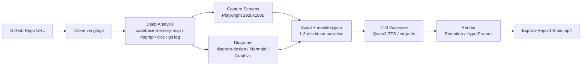

# RepoStudio

[](https://github.com/wushidiguo/RepoStudio/actions/workflows/ci.yml)
[](LICENSE)

把一个任意 GitHub 仓库变成 1~3 分钟「代码库讲解视频」的 Codex skill 项目。

`repo-to-video` skill 会自主完成：clone 仓库 → 深度分析代码库 → 截取关键画面 →
绘制架构/流程图 → 撰写 1~3 分钟讲解脚本 → TTS 配音 → 渲染最终视频（MP4）。

> English version: [README.md](README.md)

## 一键安装

Windows (PowerShell):

```powershell
.\install.ps1            # 仅安装 skill + 环境检查
.\install.ps1 -Full      # 安装 skill 及全部依赖（winget: git/node/python/ffmpeg/gh + edge-tts + Remotion 模板 + codebase-memory-mcp）
```

macOS / Linux:

```bash
bash install.sh
bash install.sh --full
```

安装完成后重启 Codex 会话，然后直接说：

> Use `$repo-to-video` to turn https://github.com/owner/repo into a 2-minute explainer video.

## 工作流程



## 项目结构

```text
RepoStudio/
├── install.ps1 / install.sh   # 一键安装脚本（把 skill 装到 $CODEX_HOME/skills）
├── README.md                  # 英文说明（默认）
├── README.zh-CN.md            # 中文说明
├── CONTRIBUTING.md            # 贡献指南
├── CODE_OF_CONDUCT.md         # 社区行为准则
├── SECURITY.md                # 安全漏洞上报
├── CHANGELOG.md               # 更新日志
├── pyproject.toml / uv.lock   # Python 工具链 + 锁定依赖（uv）
├── tests/                     # pytest 单元测试
├── .github/                   # CI 工作流 + Issue/PR 模板
├── LICENSE
└── skills/repo-to-video/
    ├── SKILL.md               # skill 入口：七阶段工作流 + 质量门禁
    ├── agents/openai.yaml     # UI 元数据
    ├── references/            # 各阶段详细打法（分析/截图/图表/脚本/TTS/渲染）
    ├── scripts/
    │   ├── estimate_duration.py  # 校验 1-3 分钟时长
    │   ├── tts.py                # Qwen3-TTS / edge-tts 配音
    │   └── capture_screens.py    # Playwright 截图
    └── assets/remotion-template/ # 可直接渲染的 Remotion 工程（manifest 驱动）
```

## 关键设计

- **深度分析优先**：优先使用 [codebase-memory-mcp](https://github.com/DeusData/codebase-memory-mcp)
  的知识图谱工具（架构、调用链、语义搜索、路由），不可用时回退到
  ripgrep + cloc + git log 人工挖掘，禁止只读 README 就下结论。
- **manifest.json 是唯一事实源**：脚本、配音、渲染全部由同一个 JSON 驱动，
  场景与画面一一对应，配音按累计时间轴自动对齐。
- **双引擎渲染**：默认 Remotion（自带模板、确定性强），环境里有 HyperFrames
  时也可切换（`npx hyperframes check && render`）。
- **TTS 分级**：有 GPU 用 Qwen3-TTS-12Hz-1.7B-CustomVoice（9 种预设音色 +
  情绪指令），没有则用 edge-tts 秒级兜底。
- **成片质感**：截图 Ken Burns 运镜、insight 数字滚动、逐词字幕烧录、EBU R128
  响度归一化，并可导出 `.srt` 字幕。
- **质量门禁**：成片必须 60~180 秒、有配音、至少 1 张截图 + 1 张图表、所有
  素材存在，ffprobe 复核后才会交付。

## 依赖说明

| 工具 | 用途 | 安装方式 |
| --- | --- | --- |
| git | clone | winget/brew/apt |
| node ≥ 18 | Remotion 渲染 | winget/brew/apt |
| python ≥ 3.9 | TTS/截图/时长脚本 | winget/brew/apt |
| ffmpeg | 音频拼接/校验 | winget/brew/apt |
| gh（可选） | 免认证 clone + 仓库元数据 | winget/brew/apt |
| codebase-memory-mcp（可选） | 深度分析 | 官方 install.ps1 / install.sh |
| Qwen3-TTS（可选，需 GPU） | 高质量配音 | pip install qwen-tts torch torchaudio soundfile |
| diagram-design（可选） | 高质量图表 | `codex plugin marketplace add cathrynlavery/diagram-design` |

## 常见问题

- **没有 GPU 怎么配音？** 用 edge-tts：`python skills/repo-to-video/scripts/tts.py --engine edge`。
- **网页应用跑不起来？** skill 会退回截图 README/docs 或代码卡片，不影响成片。
- **想换 HyperFrames？** 在 manifest 里设 `"engine": "hyperframes"`，按
  `references/rendering.md` 走 hyperframes CLI 渲染。

## 开发与贡献

欢迎提 Issue 和 PR。环境搭建与规范见 [CONTRIBUTING.md](CONTRIBUTING.md)，
社区行为准则见 [CODE_OF_CONDUCT.md](CODE_OF_CONDUCT.md)，安全漏洞请按
[SECURITY.md](SECURITY.md) 私下上报。项目用 [uv](https://docs.astral.sh/uv/)
管理可复现的 Python 环境：

```bash
uv sync --extra dev   # 安装 edge-tts / playwright / pytest / ruff
uv run pytest         # 跑测试
uv run ruff check .   # lint
```

## License

[MIT](LICENSE) © 2026 Wu Kai
